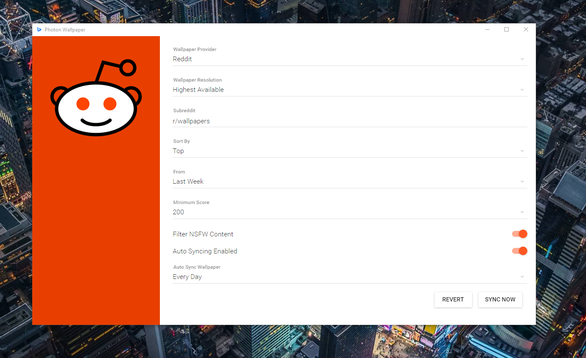
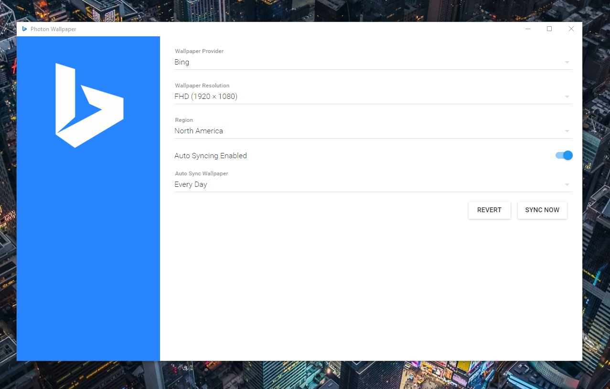

#Photon Wallpaper
 
 
 

### What is Photon Wallpaper?

A clean way of keeping your wallpaper synced with Bing or Reddit subreddits!

### Requirements

 - Windows 7+
 - OSX 10.8+
 - Ethenet Connection

### Screenshots

### Where's the beef!

Pre-built binarys & setup files can be found in the [Releases Tab](https://github.com/luigiplr/photon-wallpaper/releases).

 

## Contributing

### Getting Started

- `npm install`

To run the app in development:

- `npm start`

Running `npm start` will download and install [Electron](http://electron.atom.io/).

### Building & Release

- `npm run release`

### Find a bug/issue or simply want to request a new feature?

[Create a Github issue/feature request!](https://github.com/luigiplr/photon-wallpaper/issues/new)

## Copyright and License

Code released under the [GPLv3](LICENSE).

